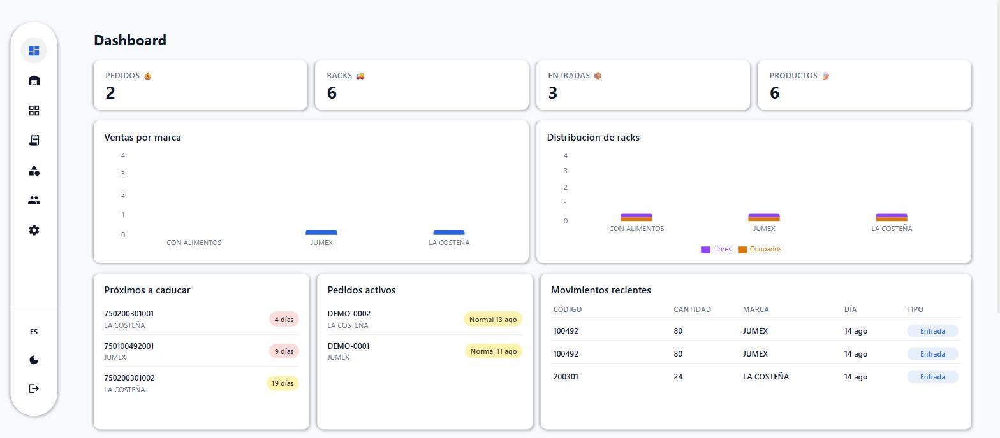
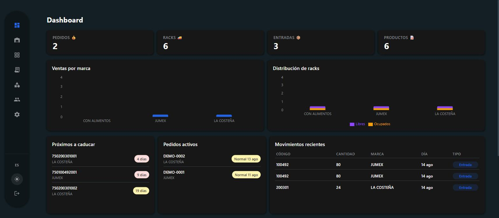
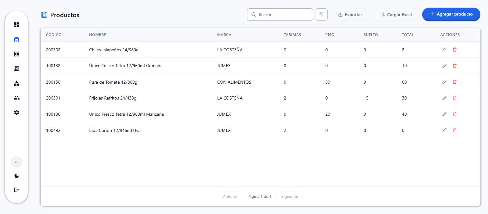
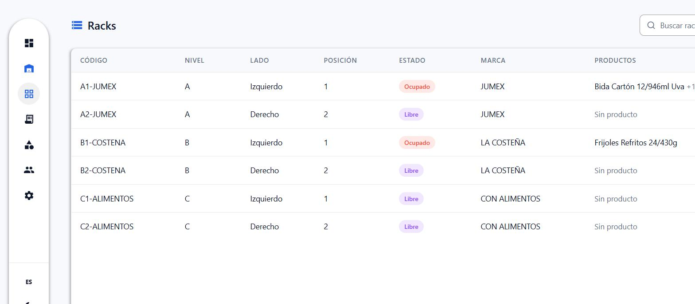

# SGA — Sistema de Gestión de Almacén

Sistema web de gestión de almacén e inventario: productos, racks, entradas de mercancía y
seguimiento de pedidos, con dashboard en tiempo real. Proyecto de portafolio — versión
refactorizada desde cero (TypeScript, arquitectura limpia, tests) de un sistema construido
originalmente para un cliente real durante una estadía profesional.


## Capturas

| Dashboard (claro) | Dashboard (oscuro) |
|---|---|
|  |  |

| Almacén | Racks |
|---|---|
|  |  |

## Funcionalidades

- **Dashboard** con métricas en tiempo real (Supabase Realtime): ventas por marca, distribución
  de racks, productos próximos a caducar, pedidos activos, movimientos recientes
- **Almacén**: CRUD de productos, búsqueda con debounce, filtro por marca, carga masiva y
  exportación a Excel
- **Racks y cajas**: control de ocupación por rack, historial de entradas con orden FIFO por
  fecha de caducidad
- **Ventas**: registro de pedidos con parser automático de facturas en PDF (4 formatos) y Excel,
  devoluciones, asignación de equipo por pedido
- **Usuarios y roles**: `admin` / `operador`, creación de usuarios vía Supabase Edge Function
- **Configuración**: marcas, categorías, módulos del sidebar, cuenta propia
- **i18n** español/inglés, tema claro/oscuro, responsive con vista de cards en mobile

## Stack tecnológico

| Capa | Tecnología |
|---|---|
| Build / UI | Vite, React 19, TypeScript |
| Estado UI | Zustand |
| Datos remotos | TanStack Query + TanStack Table |
| Backend | Supabase (Postgres, Auth, Storage, Realtime, Edge Functions) |
| Estilos | styled-components (temas claro/oscuro) |
| Formularios | react-hook-form |
| Gráficas | Recharts |
| Parseo de archivos | pdfjs-dist, xlsx |
| i18n | react-i18next |
| Tests | Vitest + Testing Library |

## Instalación y configuración local

### Requisitos

- Node 20+
- [pnpm](https://pnpm.io/) — este proyecto usa pnpm, no npm ni yarn
- Una cuenta de [Supabase](https://supabase.com/) (el plan gratuito alcanza de sobra)

### 1. Clonar e instalar dependencias

```bash
git clone git@github.com:ivanocdev/sga-web.git
cd sga-web
pnpm install
```

### 2. Crear el proyecto en Supabase

1. Creá un proyecto nuevo en [supabase.com](https://supabase.com/)
2. Andá a **SQL Editor** y corré, en este orden:
   1. `supabase/schema.sql` — crea todas las tablas, la función `get_mi_rol()` y las relaciones
   2. Todos los archivos de `supabase/policies/*.sql` (en cualquier orden entre ellos) — habilitan
      RLS y las políticas de acceso por rol
3. (Opcional, recomendado) Creá los dos buckets de Storage desde **Storage**:
   - `facturas` — privado, máx. 10 MB, acepta PDF y Excel
   - `imagenes` — público, máx. 2 MB, acepta PNG/JPEG/SVG/WebP
4. (Opcional) Desplegá la Edge Function para crear usuarios:
   ```bash
   supabase functions deploy crear-usuario --project-ref <tu-project-ref>
   ```
   Sin esto, todo funciona igual excepto crear usuarios nuevos desde Configuración → Usuarios.

### 3. Variables de entorno

```bash
cp .env.example .env
```

Completá `.env` con la URL y la anon key de tu proyecto (**Settings → API** en el dashboard de
Supabase):

```
VITE_SUPABASE_URL=https://tu-proyecto.supabase.co
VITE_SUPABASE_ANON_KEY=eyJ...
```

### 4. Crear tu primer usuario

1. Corré la app (`pnpm dev`) y andá a `/login`
2. Registrate desde el dashboard de Supabase en **Authentication → Users → Add user** con tu
   correo y contraseña
3. Insertá tu fila correspondiente en `usuarios` (reemplazá el UUID por el que te dio Supabase):
   ```sql
   insert into usuarios (id, nombre, correo, rol, activo)
   values ('<uuid-del-usuario>', 'Tu Nombre', 'tu@correo.com', 'admin', true);
   ```
4. (Opcional) Corré `seed.sql` para tener marcas, productos, racks y pedidos de ejemplo — así el
   dashboard no arranca vacío

### 5. Levantar el proyecto

```bash
pnpm dev          # servidor de desarrollo
pnpm test         # correr los tests una vez
pnpm test:watch   # tests en modo watch
pnpm build        # build de producción
pnpm lint         # eslint
```

## Arquitectura

### Separación de responsabilidades

```
Services   → toda la lógica de Supabase (queries y mutations), no tocan estado de React
Hooks      → TanStack Query envolviendo los services, manejan cache e invalidaciones
Stores     → Zustand solo para estado de UI (tema, filtros activos, drawer mobile) — nunca datos remotos
Components → presentación; la lógica de negocio vive en services/hooks, no en componentes
```

Esta separación es la decisión de arquitectura más importante del proyecto: evita la mezcla de
fetching y estado global que tenía la versión original, y hace que cada capa se pueda testear por
separado (ver `tests/unit/productosService.test.ts`, que mockea Supabase para probar los services
sin pegarle a una base real).

### Estructura de carpetas

```
src/
├── components/
│   ├── atoms/        # Button, FloatingInput, SearchInput, ThemeToggle...
│   ├── molecules/     # combinaciones simples (FiltroMarcas, CargarProductosExcel...)
│   ├── organisms/
│   │   ├── cards/      # cards del dashboard y configuración
│   │   ├── forms/      # un form por entidad, con react-hook-form
│   │   ├── sidebar/     # sidebar desktop (cápsula) + drawer mobile
│   │   └── tables/      # tablas con TanStack Table + vista de cards en mobile
│   └── templates/      # MainLayout, ProtectedRoute
├── pages/              # una por ruta, cargadas con React.lazy()
├── services/           # toda la comunicación con Supabase
├── hooks/              # TanStack Query hooks que consumen los services
├── store/              # Zustand — solo estado de UI
├── context/            # AuthContext
├── router/              # rutas + guards (ProtectedRoute/PublicRoute/AdminRoute)
├── utils/               # funciones puras: parsers de PDF/Excel, validaciones, export
├── types/               # interfaces TypeScript por dominio
├── i18n/                # es.json / en.json
└── styles/              # tema claro/oscuro, breakpoints, mixins
```

### Decisiones técnicas puntuales

- **Sidebar como cápsula flotante, no un panel ancho**: el diseño original (ver capturas) usa un
  rail angosto solo-íconos. El color de la cápsula sí cambia con el tema (blanco en claro, navy
  oscuro en dark) — el sidebar mobile (drawer con etiquetas) es intencionalmente distinto, es un
  patrón responsive estándar, no una inconsistencia.
- **`calcularTotales` centralizado**: los totales de inventario (`cantidad_piso`, `cantidad_suelto`,
  `tarimas`, `total`) se calculan en una sola función pura en `productosService.ts`, no en cada
  componente que los necesita.
- **Parsers de factura como funciones puras**: `detectarFormato` (PDF) separa la lógica de parseo
  de texto de la extracción del PDF en sí (que depende de `pdfjs-dist`), así se puede testear con
  texto plano sin necesitar un PDF real.
- **RLS + GRANT explícitos por tabla**: cada tabla tiene RLS habilitado y policies por rol
  (`admin`/`operador`) vía la función `get_mi_rol()` (`SECURITY DEFINER`, evita recursión). El
  anon key es seguro de exponer en el cliente porque nunca se usa la service role key fuera de la
  Edge Function de creación de usuarios.
- **Sin `console.log` en producción**: solo `console.error` en catches, forzado por ESLint
  (`no-console`).

## Deploy en Vercel

El proyecto es una SPA de Vite — Vercel la detecta automáticamente, no hace falta `vercel.json`.

1. Importá el repo en [vercel.com](https://vercel.com/)
2. En **Settings → Environment Variables**, agregá las mismas dos variables del `.env` local:
   - `VITE_SUPABASE_URL`
   - `VITE_SUPABASE_ANON_KEY`
3. Deploy automático en cada push a `main`

No hace falta ninguna variable adicional — el frontend nunca usa la service role key (eso vive
solo del lado de la Edge Function, dentro de Supabase).

## Contribuir

Este es un proyecto de portafolio personal, pero si encontrás un bug o tenés una sugerencia,
las issues y pull requests son bienvenidas:

1. Forkeá el repo y creá una rama descriptiva (`fix/nombre-del-bug`, `feat/nombre-de-la-cosa`)
2. Corré `pnpm lint` y `pnpm test` antes de abrir el PR
3. Los mensajes de commit siguen [Conventional Commits](https://www.conventionalcommits.org/) en
   español, en infinitivo: `feat: agregar filtro por categoría`, `fix: corregir cálculo de tarimas`

## Licencia

[MIT](LICENSE) — usá el código como quieras, con o sin atribución.
